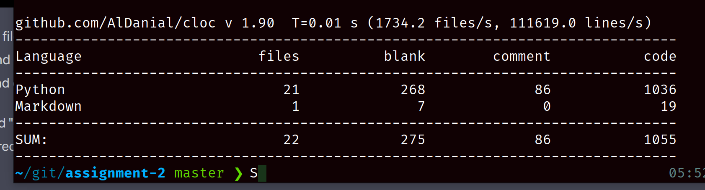

# Hello world!

Welcome to my solution to UTS assignment #2 48024 (Programming 2). A Python Tkinter app for flights.

## Notes

- not very pythonic or friendly to throw exceptions, but the
  skeleton recommended they be throw (aka. raised in Python)
- data classes / records define a to_string method, Python has `__str__` for this purpose
- several instance methods missing `self`
- missing collection lookups in scaffold code
- list init often done iteratively with for-loop (could use list init's)
- some specs only available in the fxml source (this is annoying and easy to miss, as it's not a clear Python requirement)
  - window sizes
  - expected styling
- tkinter not handling the provided assets adds further unspecced work to hack a workaround
- linux tkinter install has different icon handling
- expected logins areare buried in the admins file

## TODO

- [ ] submit this repo as a `zip` to Canvas
- [ ] submit source code to Ed
- [ ] submit the assignment cover sheet
